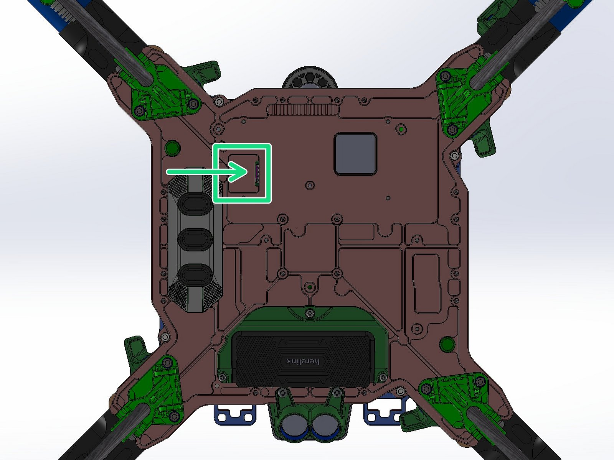
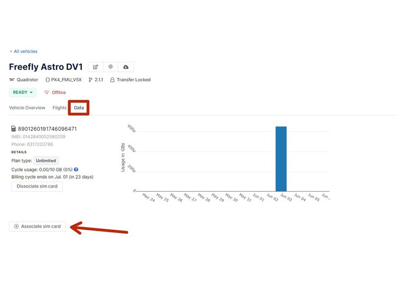
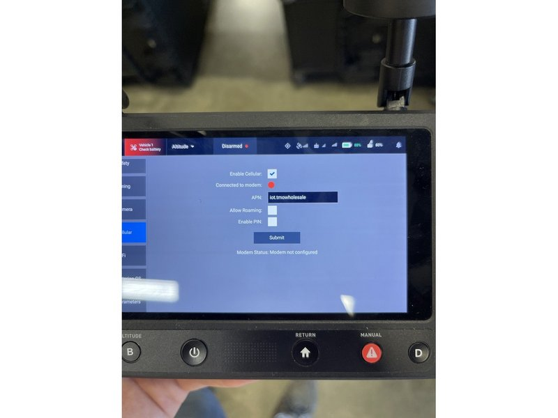

# Installing a SIM Card

### Installing a SIM in Astro

1. Select nano SIM card and carrier of your choice which falls in the RF Bands Astro supports.
   1. AT\&T and Verizon are recommended. T-Mobile has also been tested and proven functional.
   2. [LTE Band Information Link](https://freefly.gitbook.io/freefly-public/products/astro/pilots-operating-handbook/systems#lte)
2. Ensure Astro is powered down and flip it over so it is resting on its prop-protectors
3. Using a 1.5mm hex driver open the SIM access port and remove the rubber cover.
4. Insert your SIM card and ensure that it has latched into the SIM slot.
5. Reinstall the SIM card cover making sure that the cover seals out the SIM port fully. Then flip Astro back over so it is standing on its landing gear.


Note: Only North American SIM cards are currently supported by Astro.


### Setting up your SIM card&#x20;

1. Browse to [http://suite.auterion.com](http://suite.auterion.com) and navigate to the 'Vehicles' page.
2. Under 'Vehicles' find the vehicle that matches the Astro's serial number.
3. Select your Vehicle, proceed to the Data tab, and then click “Associate SIM Card” .
4. Type in the SIM card number and select 'Associate'. Wait until the Suite refreshes and the SIM is associated with Astro
   1. You may get a warning that data is not yet available, this may happen if the SIM has just been activated or no data has been transmitted to the Suite via LTE.
5. Turn on Astro and the Herelink controller.
6. Navigate to the Cellular setup menu under 'Vehicle Setup' on AMC.
7. Ensure that the screen resembles the one shown in the image.
   1. If everything is greyed out, make sure the Astro has had time to fully connect to the Herelink and then try restarting the AMC app on the Herelink controller.
8. Check the box to enable a cellular connection and then enter in your SIM card's APN address.
   1. You can find the APN by inserting the SIM into your cellphone and checking the APN address under the Cellular or Carrier Network Settings. If the APN is not listed in your phone settings you may need to contact the service provider for the address.
9. Once both fields are completed hit 'Submit' and wait for the 'Connection to Modem' indicator to turn GREEN.&#x20;
   1. If there is an error in the APN or the SIM cannot reach service the modem connection may still indicate RED.


You only need to setup the SIM card once! The Cellular menu on AMC will reset on each power cycles and show a RED indicator but the settings will have been saved to the aircraft and data will flow when Astro is located in an area where there is cell service..


### SIM Card Options


Customers have reported that these SIM cards have worked with Astro on the specified cell phone network. Please keep in mind that these claims have not been verified or tested by Freefly. For more information, see the [**LTE** ](https://freefly.gitbook.io/astro-public/astro/pilots-operating-handbook/network-and-connectivity#lte)section of our Network and Connectivity page.&#x20;


| SIM Card | Location      |
| -------- | ------------- |
| T-Mobile | United States |
| TELUS    | Canada        |


Astro is compatible with the following LTE bands: B2, B4, B5, B12, B13, B14, B25, B26, B66, B71

