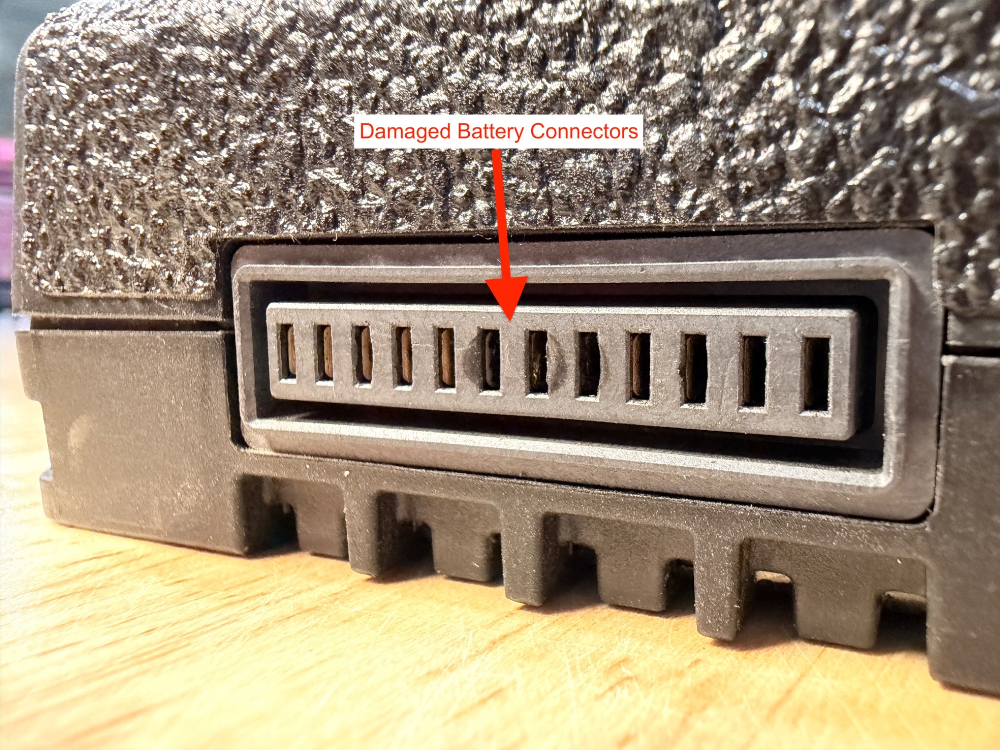
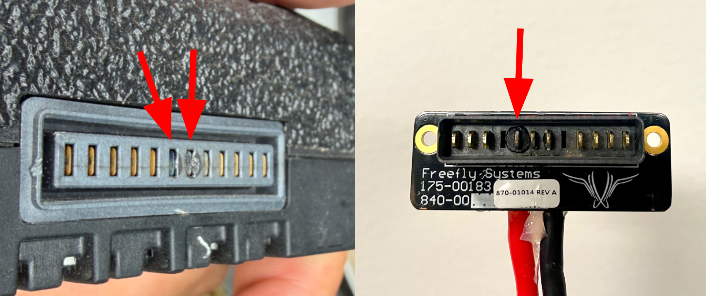

# SL8/Astro Battery Connectors

**We recommend all Astro pilots routinely check the aircraft and SL8 battery connectors for signs of damage, debris, or excessive wear.**

## Inspect Connectors&#x20;

* Inspect the battery connectors on Astro for melted plastic and / or solder at the base of the power pins. **Do not fly Astro if a connector is damaged** and contact Freefly Support for further guidance . Note some wear and marking is normal on Astro side connectors &#x20;
* Inspect all SL8 battery connectors for melted plastic, debris, or dirt. **Do not fly any SL8 battery if the connector is damaged** and contact Freefly Support for further guidance.&#x20;
* Debris and dirt can be gently removed with compressed air from the SL8 connector
* Astro aircraft side connectors can be cleaned with compressesd air or with a toothbrush and 99% Isoproply Alcohol&#x20;


Never remove debris from the battery with tweezers. If debris cannot be removed from the battery with compressed air, the battery may need to be returned to Freefly or disposed of.&#x20;


