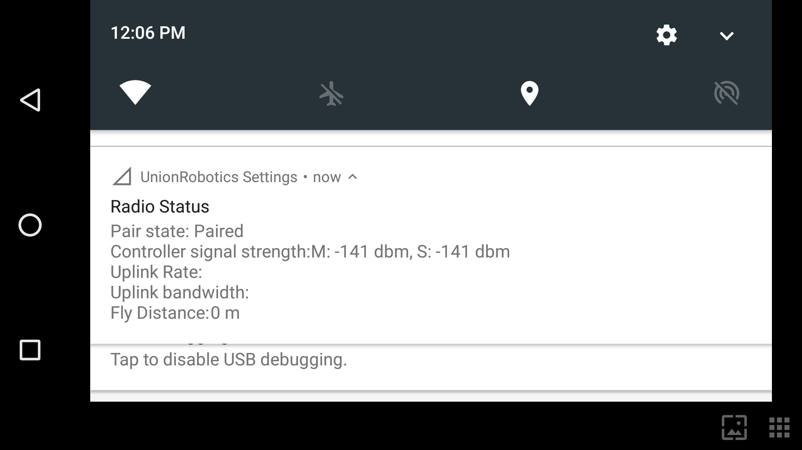

# Herelink Controller Maintenance


While Herelink is a product available for purchase outside of Freefly, please keep in mind that the Astro implementation of Herelink is uniquely tailored for optimal performance and functionality. We don't recommend accessing any of the ports available on the Herelink Air Unit, as it may interfere with some of these optimizations or may even be disabled. \
\
The [Herelink wiki](https://docs.cubepilot.org/user-guides/herelink/herelink-overview) can be helpful for some questions, but may not provide accurate information in the context of Astro. If you have any questions or concerns, don't hesitate to reach out to contact@freeflysystems.com or[ Contact Us](https://freeflysystems.com/contact) through our website.&#x20;


## Herelink Binding


Only one Herelink can be paired with Astro at a time. If another remote is paired, it breaks the connection with the previous remote, even after the second remote has been powered off.


Prepare non-metallic tweezers or toothpick.

[Remove the Herelink cover and seal.](removing-reinstalling-the-herelink-cover.md)

Install one battery on Astro and activate.

Turn on the Herelink Pilot Handset.

Use your finger to pull down from the top of the screen and select the Herelink Radio Status message.

On the Herelink Radio page, tap “Pair”.

.png>)

Using tweezers, press and hold the Herelink Air Unit "Pair/Reset" button until LED2 blinks (hold approximately 3 seconds).

.jpg>)

\
Verify the Herelink Pilot Handset shows a status of "PAIRED" and the uplink rate is non-zero.

Open the AMC app on Herelink Pilot Handset and verify connection to the aircraft.\
\
Power off Astro and Herelink Pilot Handset.

[Reinstall the Herelink cover and seal.](removing-reinstalling-the-herelink-cover.md)

