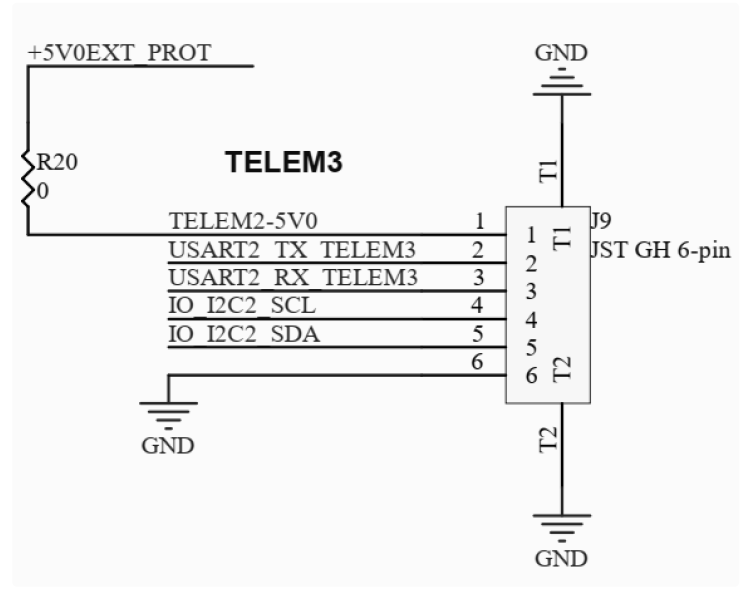
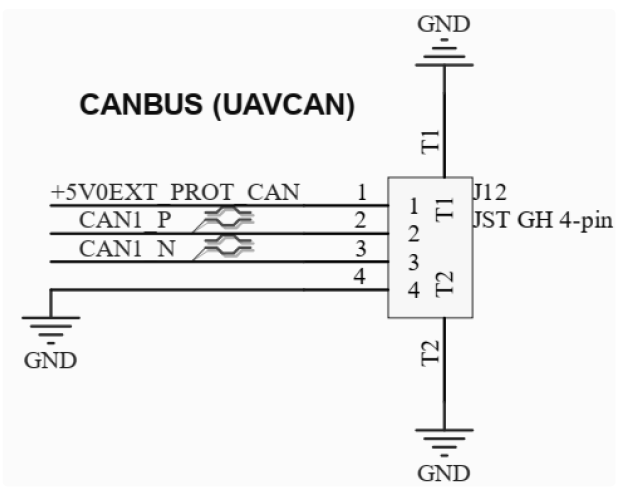
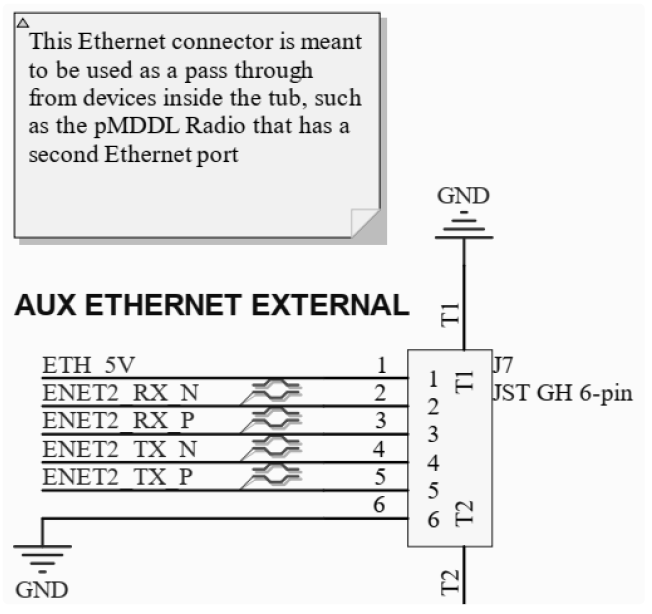

# Electrical Interfaces

## **I/O and Electrical Panel**

### **USB-C**

Configured as ethernet adapter.

Functionality:&#x20;

* connection to payload
* mass storage (e.g. flash drive)
* firmware updates


It is not possible to power Astro via this port. For example, to update firmware or download logs, power Astro with a battery.


### Payload

Connector type: JST-ZPD 26-pin&#x20;

<figure><figcaption></figcaption></figure>

This connector can be accessed directly or to pass connections to the [Smart Dovetail](payload-mounting-interfaces.md#smart-dovetail) connector.

The mating connector to build a payload cable is [ZPDR-26V-S](https://www.digikey.com/en/products/detail/jst-sales-america-inc/ZPDR-26V-S/2472569).

### TELEM3&#x20;

Connector: JST GH 6-pin

### **AUX UART**

Connector: JST GH 6-pin

### **PWM**

Connector: headers, 0.1 inch spacing

PWM outputs are active when the aircraft is powered on.

#### **Setup**

In AMC, select the output pins by navigating to Menu > Vehicle Setup > Parameters. Possible outputs are:&#x20;

| IO board label | Parameter name |
| -------------- | -------------- |
| 1              | RC\_MAP\_AUX1  |
| 2              | RC\_MAP\_AUX2  |
| 3              | RC\_MAP\_AUX3  |
| 4              | RC\_MAP\_FLAPS |

For each output, select an input source channel (i.e. [Herelink hardware button](../components/pilot-handsets/#hardware-controls) you will push to trigger a change in PWM).

| Herelink  | Channel |
| --------- | ------- |
| Wheel     | 5       |
| Button D  | 10      |

PWM output values (e.g. 1100 us) are controlled by these parameters (read more in the [PX4 Parameter Reference](https://dev.px4.io/master/en/advanced/parameter_reference.html)).

| Parameter       | Function                                                                                                                                                    |
| --------------- | ----------------------------------------------------------------------------------------------------------------------------------------------------------- |
| PWM\_AUX\_DIS1  | PWM output when autopilot is not armed. When set to -1 the value for PWM\_AUX\_DISARMED will be used. a similar parameter is availabel for each channel     |
| PWM\_AUX\_MIN1  | Minimum PWM pulse for this output. When set to -1 the value for PWM\_AUX\_MIN will be used.                                                                 |
| PWM\_AUX\_MAX1  | Maximum PWM pulse for this output. When set to -1 the value for PWM\_AUX\_MAX will be used.                                                                 |
| PWM\_AUX\_REV1  | Invert direction.                                                                                                                                           |
| PWM\_AUX\_FAIL1 | PWM output if autopilot is in failsafe mode. When set to -1 the value is set automatically depending if the actuator is a motor (900us) or a servo (1500us) |

### **CAN**

Connector: JST GH 4-pin

### **Console pinout**

Console is a special serial (UART) port that is useful for troubleshooting applications running on the IMX8 processor inside Astro.

Connector: JST GH 6-pin

### **Ethernet**

Connector: JST GH 6-pin

### **Bind Button**&#x20;

Not active or user configurable. This button is included for future expansion.

### Battery V

Connector: XT-30

* Battery Voltage: 18 - 25.2 VDC
* Continuous current: 5.5 A (overcurrent protection set to approximately 5 A)

The XT-30 connector provides direct access to the raw battery output. Please note that the overcurrent protection is set to trip around 5 A, though variations may occur, with testing showing cutoff points between 4.7 and 5.3 A. We recommend keeping the load under 4.5 A to avoid triggering the protection circuit.

**Important Notes**:

* If you are not using a gimbal, you can draw up to 4.5 A through the XT-30 connector.
* If you have a gimbal attached, which typically draws about 1 A, you’ll need to limit the remaining load on the XT-30 to 3.5 - 4 A.
* The circuit responds within a few milliseconds, so any large inrush currents may activate the overcurrent protection.


In order for the XT30 to behave as expected, the Herelink needs to be powered on and in communication with Astro.


