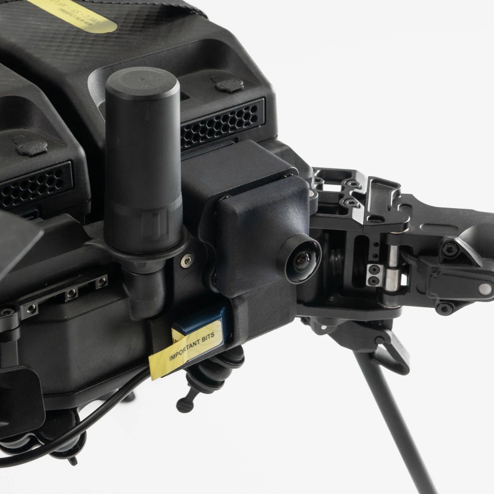

# FPV Camera





## Installation&#x20;

<figure><figcaption></figcaption></figure>

* Mount the FPV module to the front of Astro with two M3x12 FHCS fasteners, which are included in the FPV kit. These use the red hex driver, included with Astro.&#x20;
* &#x20;Plug the cable into the USB-C port on the Astro IO panel
* Upgrade your Astro firmware to 1.5 or later


The FPV module can stay on Astro while folded up in the case!



If you're having trouble getting video, make sure the USB-C cable is fully plugged in


#### USB-C Thumb Drive Port

* Plug in your USB-C thumb drive to the port on the front of the module
* Under camera settings, you should see the thumb drive icon light up and the storage change to the available space on the drive. &#x20;


You can only save images/video from the FPV camera on to an external USB drive


### FPV Module Variants

We offer two variants of the FPV module for Astro, you can identify which variant you have have by the small notch on the front cover below the lens:&#x20;

<figure><figcaption></figcaption></figure>
