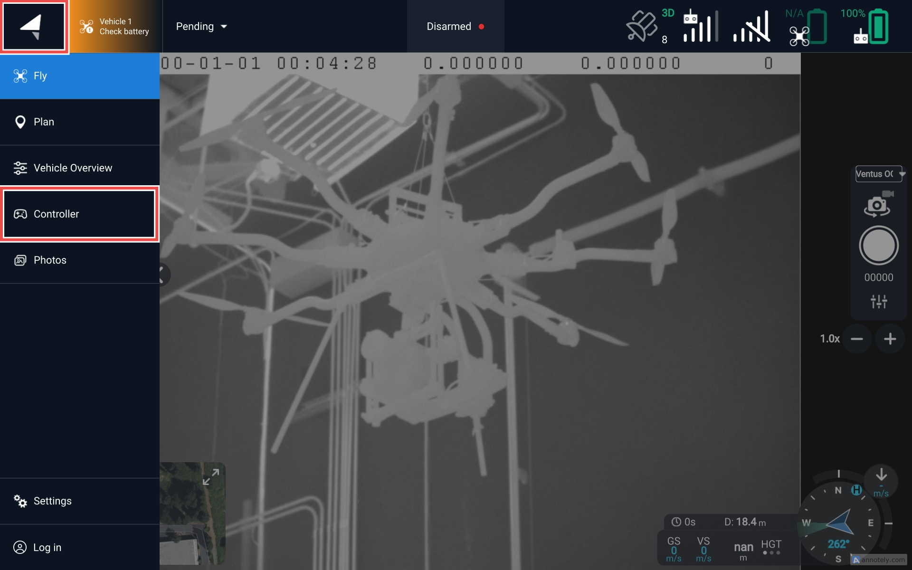
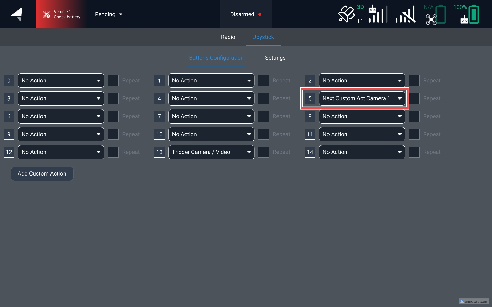

# Configure Gas Enhancement Mode

Gas Enhancement Mode (GEM) On/Off may be mapped to a Pilot Pro button for easy GEM toggling. Follow the instructions below to configure your Pilot Pro.

1. Open AMC.
2. To access the Controller settings menu, tap the Auterion logo at the upper left of AMC and then tap Controller.

<figure><figcaption></figcaption></figure>

3. Switch to the Joystick settings and pick **Next Custom Action Camera 1** for the button you want to use. In the screenshots below, the button R2 on the right-hand Pilot Pro grip is used.\
   \
   The Joystick screen will show button presses to show Pilot Pro button mapping to AMC buttons 0-14. Press any button on Pilot Pro to illuminate the corresponding AMC button number.

<figure><figcaption></figcaption></figure>

<figure><figcaption></figcaption></figure>

4. GEM mode may now be toggled on/off by pressing the assigned button.
