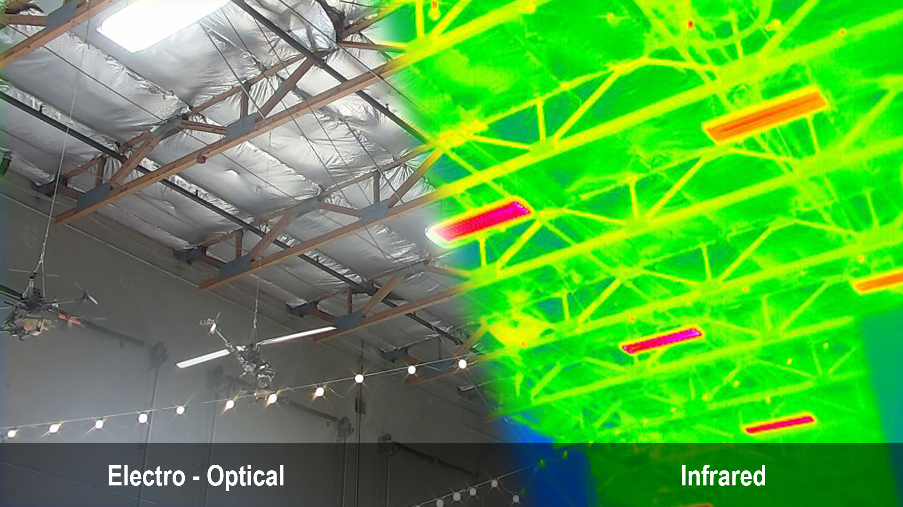

# Glossary

## EO / IR

EO and IR refer to types of photographic sensors.

* EO stands for "Electro-Optical", and functions as a standard camera for capturing visible light, just like any smartphone camera.
* IR stands for "Infrared", and functions to capture thermal data in a video stream. Temperatures are mapped to colors with a variety of ranges, color pallets, and thresholds available depending on your specific use.

<figure><figcaption></figcaption></figure>

## FOV

FOV stands for "Field of View", and is represented by an angle, typically in degrees. Think of it as a cone expanding out infinitely in front of a lens with the width defined as an angle. Anything within this cone is visible in your image.

* HFOV and VFOV are commonly used to describe the horizontal and vertical field of view, respectively.

<figure><figcaption></figcaption></figure>

## Pan, Roll, Tilt

These refer to the axis on which your gimbal can rotate.

* Pan controls left-to-right rotation. It uses the motor at the very top of your gimbal and is controlled via the direction of your aircraft. Pan may be adjusted using the yaw control on your aircraft.

<figure><figcaption></figcaption></figure>

* Roll controls the horizon of your camera. The motor is located at the back of your gimbal, behind the camera, and it is updated automatically to keep your camera level to the horizon.

<figure><figcaption></figcaption></figure>

* Tilt controls the angle of the camera vertically, allowing you to point down, up, level, or anything in between. The aircraft operator can control tilt using the tilt wheel on the top left of the Herelink controller.

<figure><figcaption></figcaption></figure>
