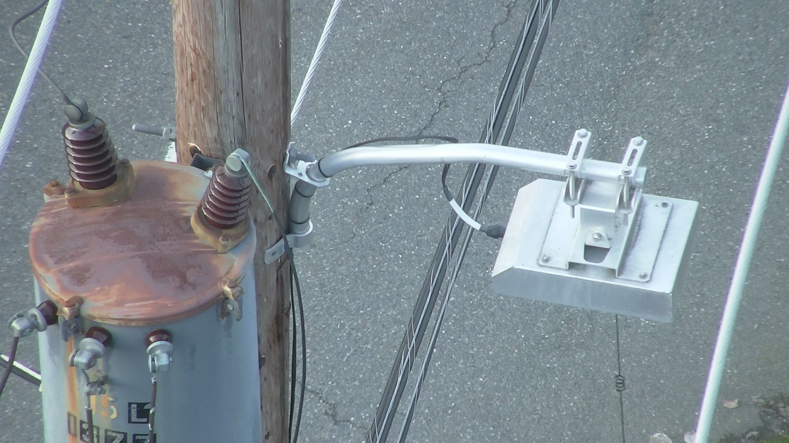

# Operating Handbook


[setting-up-astro-with-wiris-pro.md](setting-up-astro-with-wiris-pro.md)



[pre-flight-planning.md](pre-flight-planning.md)



[inspection-workflow.md](inspection-workflow.md)



[advanced-operation.md](advanced-operation.md)



[downloading-media-example-output.md](downloading-media-example-output.md)


<figure><figcaption>
Astro + Wiris Pro Payload in the Air
</figcaption></figure>

<figure><figcaption>
EO Inspection Image from the Wiris Pro Payload
</figcaption></figure>

<figure><figcaption>
Thermal image of a search and rescue mission 
</figcaption></figure>

