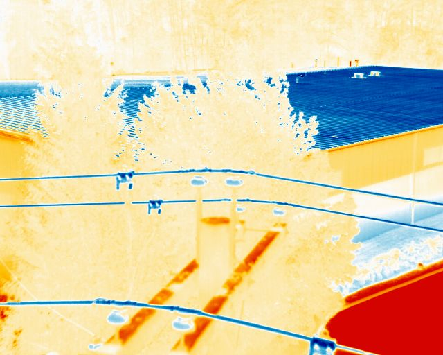
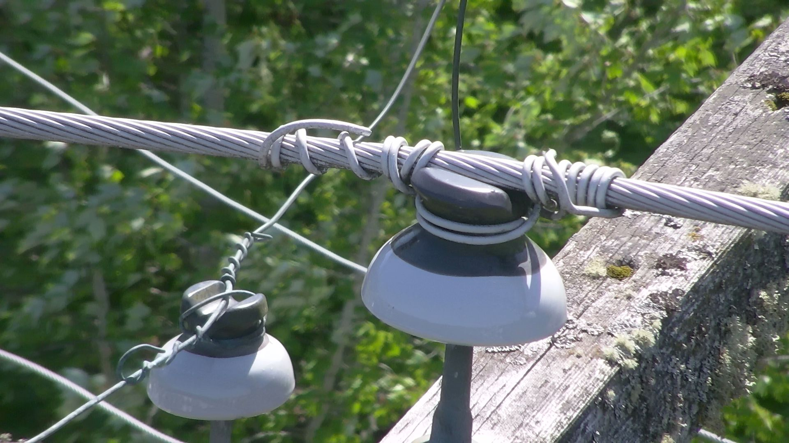
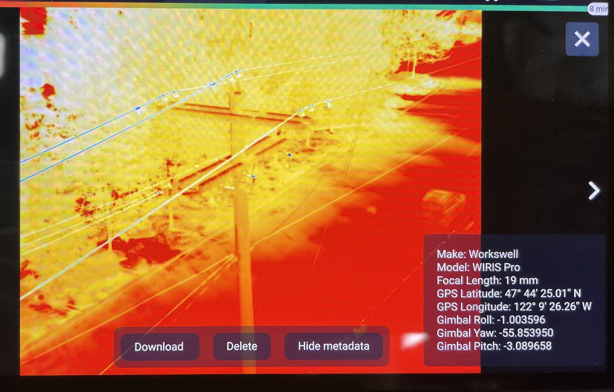
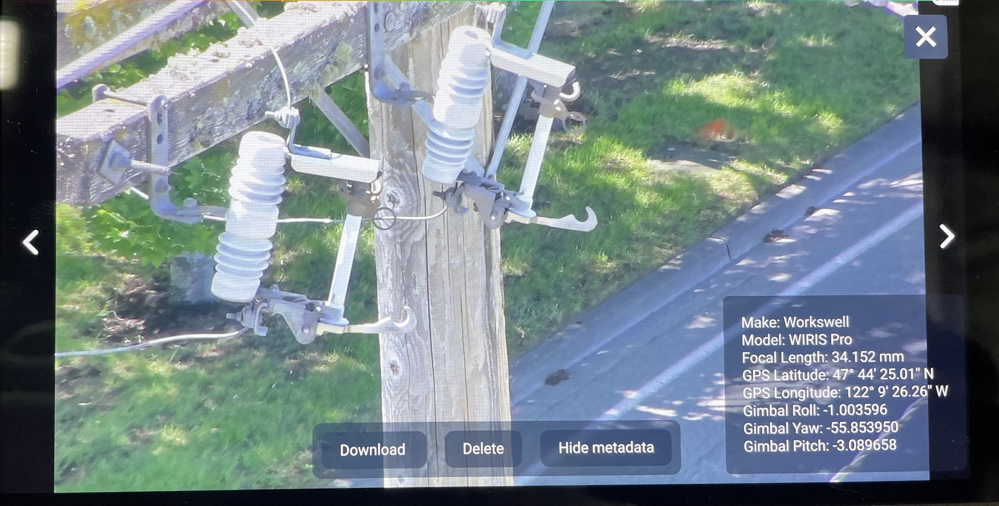

# Downloading Media/Example Output

## Example Output

Click the link below to download sample images in all possible formats.&#x20;



<figure><figcaption>
Wiris Pro IR Image
</figcaption></figure>

<figure><figcaption>
Wiris Pro EO image at 10x Zoom
</figcaption></figure>

When images are saved to the USB drive, they are geotagged with the GPS lat. and long. Gimbal attitude is visible in the gallery, but is not currently included in the image meta data.&#x20;

These are viewable in the gallery or in the metadata of the image on a PC

<figure><figcaption>
Wiris Pro IR image metadata
</figcaption></figure>

<figure><figcaption>
Wiris Pro EO image metadata
</figcaption></figure>

<figure><figcaption></figcaption></figure>

## Viewing Media

Images can be previewed in the gallery in AMC during or after a flight.

Images from the EO camera can be saved in JPEG or TIFF format, and can be opened in most photo software. EO Video is saved as an MP4 file, IR video as a .AVI file.&#x20;

Images from the IR camera can be saved as a Radiometric JPEG or TIFF. Video can be saved as Thermal Encoded or as Radiometric video. Workswell ThermoLab software is required to view thermal video shot in Radiometric mode, and can be downloaded here:



### USB Drive

* To download photos from the USB drive, remove it from Astro and insert it into a computer. Then, move the files off&#x20;

### Wiris Pro SSD


**Do NOT format the SSD of the Wiris Pro when connected to a PC. This can brick the camera and will require it being sent back for repair.**


* To remove media stored on the SSD, first power the Wiris Pro Payload on the aircraft. Then connect a cable to the micro-USB port on the side of the Wiris Pro. The drive should appear on a computer as ‘Wiris SSD’, with the files organized in folders by date.
* Drag the selected media off the Wiris SSD folder on to your computer.
* Right-click and 'Eject' the Wiris drive, then power off the drone and gimbal


Make sure to eject the Wiris drive from you computer before unplugging the cable. Power cycle the aircraft and gimbal before capturing any additional video or photos.&#x20;



The video feed may stop after disconnecting from a PC. This is normal, the video will resume after a reboot of the aircraft



**Do NOT format the SSD of the Wiris Pro when connected to a PC. This can brick the camera and will require it being sent back for repair.**&#x54;he formatting option for the SSD of the Wiris Pro can be found in the camera settings under Advanced SSD Options - Format SSD



[camera-software.md](../camera-software.md)

