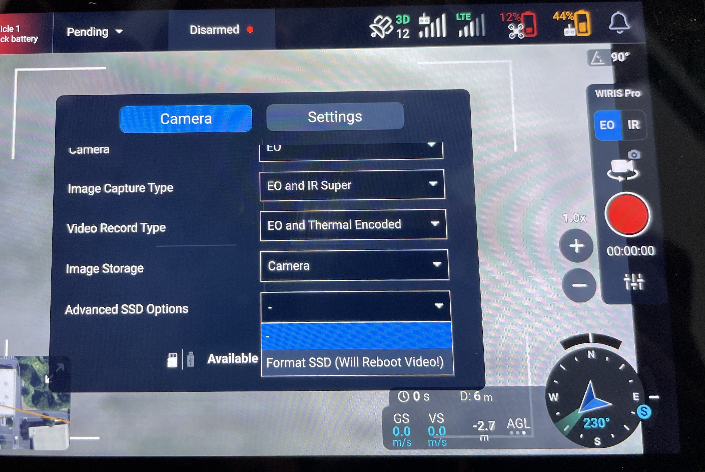

# Formatting Media

## USB Drive


[usb-formatting.md](../../workflows-maintenance-updates/usb-formatting.md)


## Wiris Pro SSD

### Download via PC


**Do NOT format the SSD of the Wiris Pro when connected to a PC. This can brick the camera and will require it being sent back for repair.**


* To remove media stored on the SSD, first power the Wiris Pro Payload on the aircraft. Then connect a cable to the micro-USB port on the side of the Wiris Pro. The drive should appear on a computer as ‘Wiris SSD’, with the files organized in folders by date.
* Drag the selected media off the Wiris SSD folder on to your computer.
* Right-click and 'Eject' the Wiris drive, then power off the drone and gimbal


Make sure to eject the Wiris drive from your computer before unplugging the cable — power cycle the aircraft and gimbal before capturing any additional video or photos.&#x20;



The video feed may stop after disconnecting from a PC. This is normal, the video will resume after a reboot of the aircraft


### Formatting Wiris SSD


**Do NOT format the SSD of the Wiris Pro when connected to a PC. This can brick the camera and will require it being sent back for repair.**


The formatting option for the SSD of the Wiris Pro can be found in the camera settings under Advanced SSD Options - Format SSD

* The will restart the connection to the Wiris Pro and takes about 30-60s to complete. It is normal for video to briefly stop working as the connection is re-established

<figure><figcaption></figcaption></figure>
