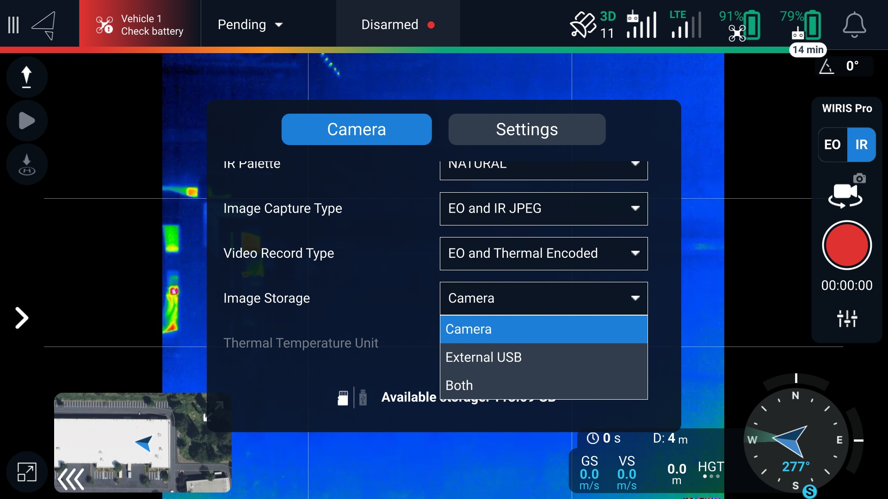
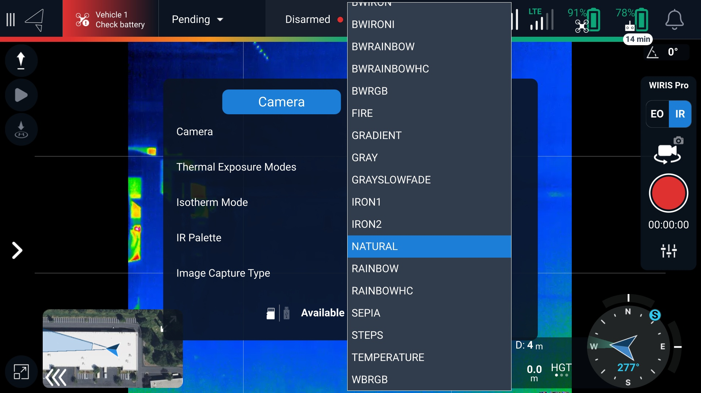
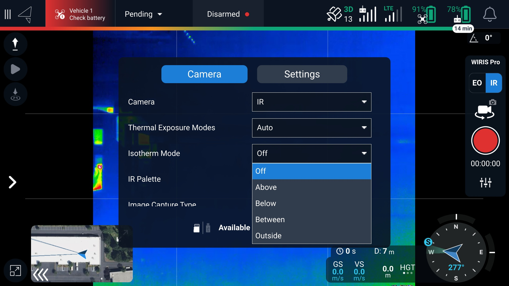
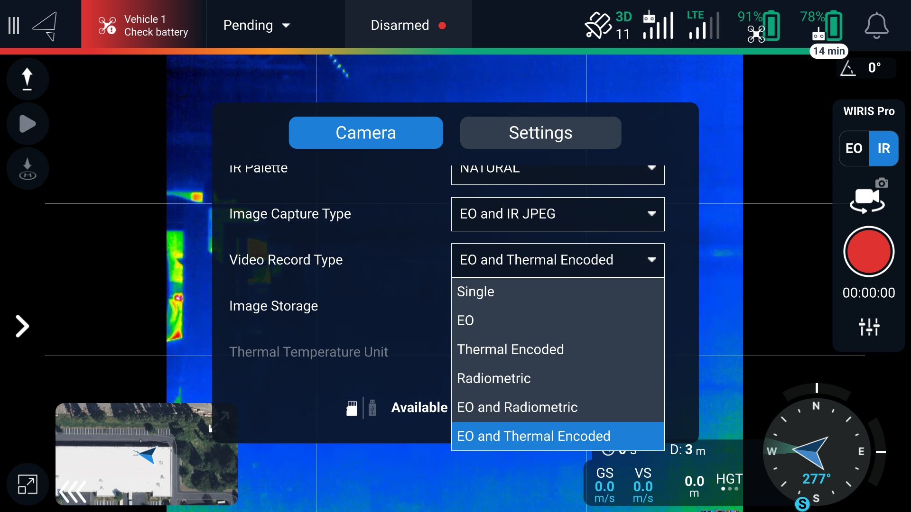

# Inspection Workflow


Read the [**Pre-flight Planning**](pre-flight-planning.md) section of the Wiris Pro Operating Handbook before arriving at your flight location to minimize downtime and come prepared for the job!



DIU Blue Astros come with stealth logging enabled, which stops GPS data from being written to imagery and logs. [Stealth logging must be disabled](https://freefly.gitbook.io/astro-public/other-user-manuals/ecosystem/diu-blue-suas#logging) to allow GPS data to be written to photos


## Connecting to the Wiris Pro

After installing the Wiris Pro Payload in the dovetail mount on Astro, power on the aircraft. Powering on the aircraft automatically powers on the gimbal and camera. It typically takes about 1 minute for the camera controls and video feed to appear in AMC.


Occasionally, we have observed that the Wiris Pro gets 'stuck' during bootup. If you are having trouble connecting to the camera, check the status light on the back of the camera. If the camera has flashing red/blue lights or a solid red light, this is likely the case. In our testing, rebooting the aircraft resolves this issue.&#x20;


## Storage/Recording settings&#x20;

* In AMC, select your media storage option. You can save to the internal Wiris SSD, a USB flash drive installed in the USB-C port on the Astro IO panel (on the bottom of the aircraft), or both.&#x20;
  * The USB flash drive storage option is not fast enough to support video recording. Video can only be recorded to the SSD.&#x20;
* Select different image/video capture options to save photos and videos from the EO camera, IR camera, or both.&#x20;

<figure><figcaption></figcaption></figure>

## Thermal camera&#x20;

You can configure the thermal camera using the following settings in the Auterion Mission Control (AMC) app for Astro.&#x20;

* IR Pallet - How temperatures are mapped to a color.

<figure><figcaption></figcaption></figure>

* Exposure Settings - these adjust the range of temperature values that can be measured, similar to shutter speed and dynamic range on a traditional camera.
  * Manual, incremental adjustments&#x20;
  * Custom, specifying the min and max temperature
  * Auto
* Isotherm Modes&#x20;
  * Isotherm ‘Alarm’ modes can be set to show a solid color when objects in the frame are within a temperature range. The options are Off, Below, Between, Outside, and Above.
  * We recommend using a grey IR pallet when using Isotherms for better clarity&#x20;


Spot metering on the IR camera is currently not supported


<figure><figcaption></figcaption></figure>

* Video/Photo Settings&#x20;
  * Video can be saved in two methods:
    * Thermal encoded - this outputs a 512x640px 30 frames per second .avi file that can natively be played in most video software. The IR pallet (color map) is baked into the image and cannot be changed later. Similarly, the temperature information of each pixel is not recorded. We recommend this mode when qualitative data is the most useful, such as looking for hotspots or searching for animals and people.
    * Radiometric - this outputs a .WSEQ file that can be opened in Workswell’s ThermoLab software. This consumes more storage but saves the temperature information of each frame. The IR pallet can be adjusted later and the temperature data of each pixel can be retrieved in post-processing. This is most useful when quantitative temperature measurements are needed. &#x20;

<figure><figcaption></figcaption></figure>

* Photo Settings
  * Radiometric JPEG - 640 x 512 px&#x20;
  * Radiometric TIFF -  640 x 512 px&#x20;
  * Super Resolution - 1266 x 1010 px image
* Lenses
  * The Wiris Pro Payload ships with a 13mm lens (\~45 degree FOV). Tighter focal length lens options are available from [Workswell](https://workswell-thermal-camera.com/workswell-wiris-pro-thermal-inspection-camera-with-ultrazoom/). Get in touch if you are interested in a different thermal lens: support@freeflysystems.com&#x20;
* EO Zoom Camera&#x20;
  * Video/Photo Settings&#x20;
    * Auto-exposure
    * 1-10x zoom range (93.5 degrees to 11.92 degrees HFOV), incremented at 1x, 1.5x, 3x, 6x, and 10x settings
    * 720p 20 frames per second video saved in a .MP4 format
