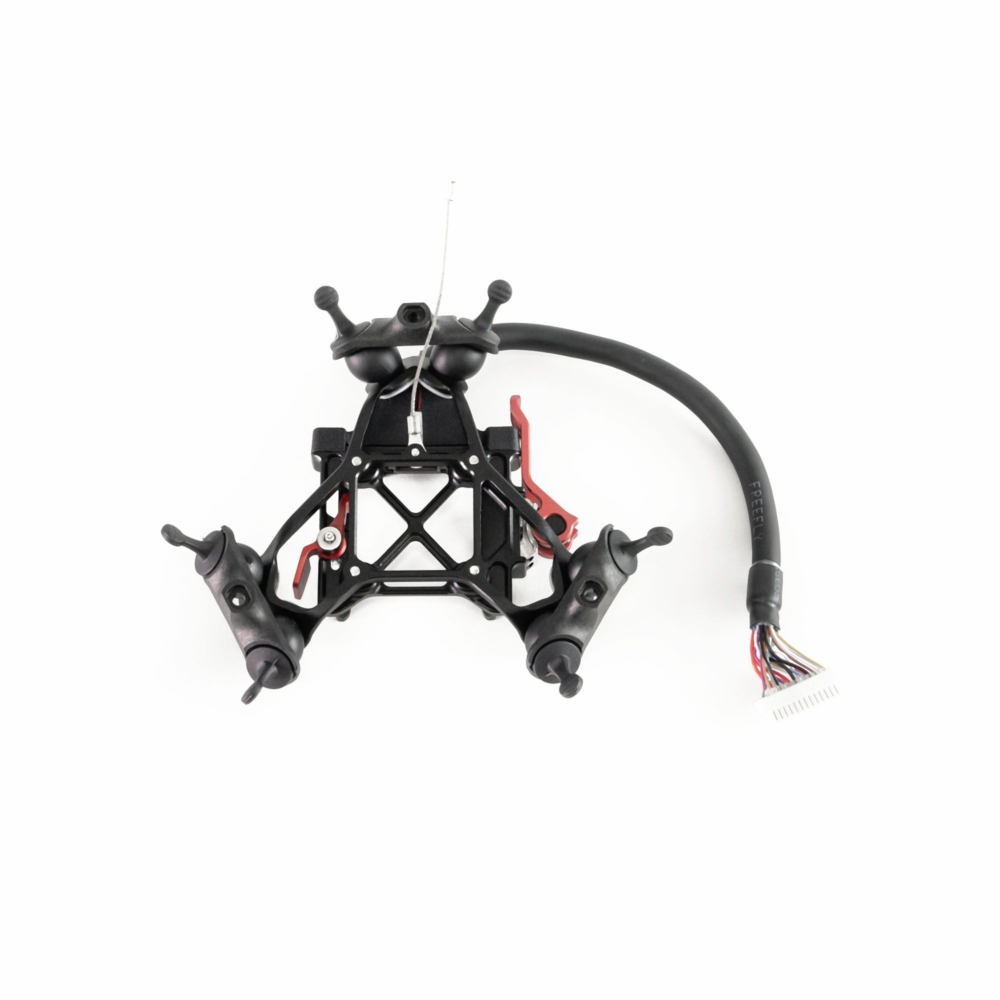

# Isolation System

The Astro Isolator is recommended for all payloads, including the LR1, A7R4, Wiris Pro, and OGI Payload.&#x20;

<figure><figcaption></figcaption></figure>




There are multiple versions of the isolator, check to make sure you have the correct version&#x20;


<figure><figcaption></figcaption></figure>

* The Astro Isolator is available[ in our store](https://store.freeflysystems.com/products/astro-isolator). Instructions on how to install the isolator on Astro are below:



This isolator has the Smart Dovetail connector attached and allows swapping between the OGI Payload, LR1 Payload, Wiris Pro Payload, A7R4 Payload, and other payloads that use the Smart Dovetail standard.&#x20;


We recommend the Astro Isolator over using the isolator that came with Astro Map. The Astro Isolator is compatible with all payloads.&#x20;


Check all the dampers are in good condition before each flight, as these can wear out over time. We recommend replacing all dampers on the isolator every 6-12 months. 30A durometer damper replacements are included in the Astro Isolator Kit and are available through our store:


