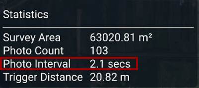
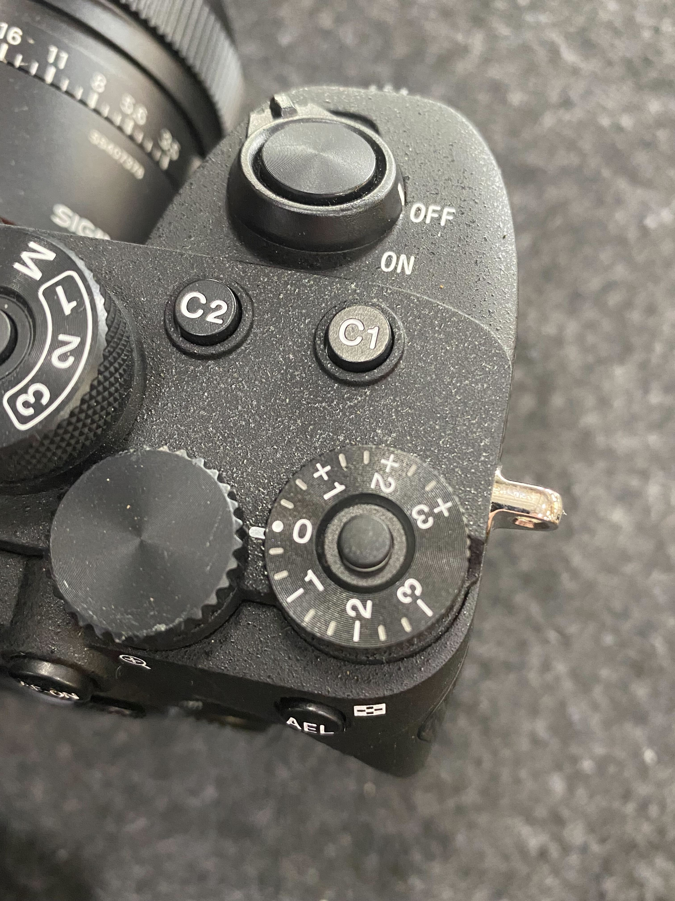
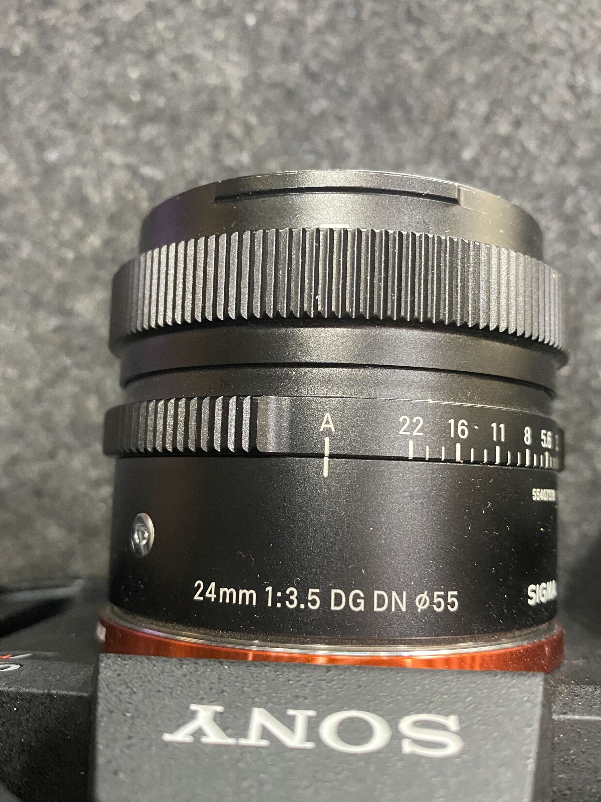
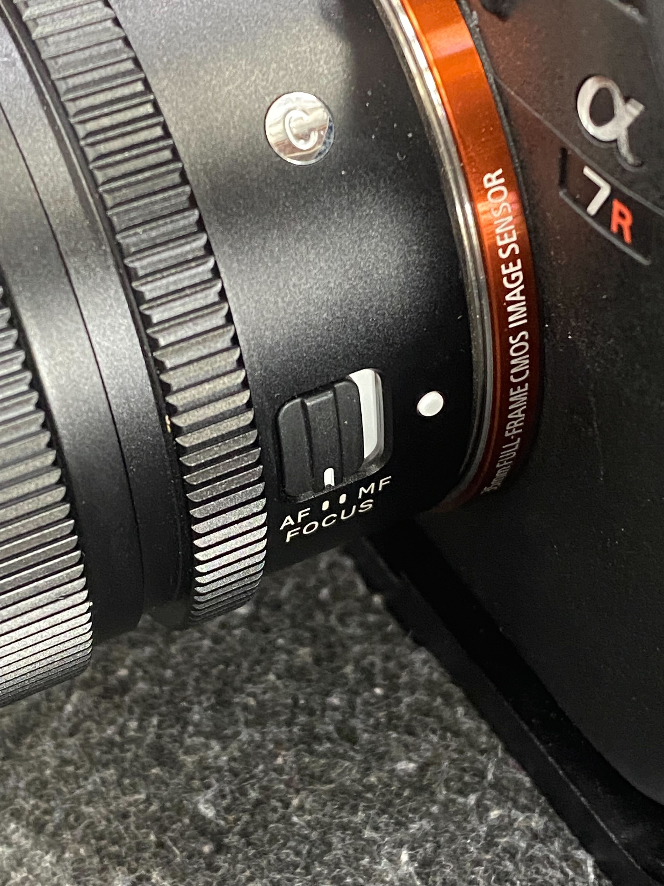

# Pre-flight Planning

## Weather

Weather is a big driver of how good the resulting maps will be. Because of lens limits and the requirement for high shutter speeds to reduce motion blur, maps are best when taken with bright light. The best results are around noon when the sun is directly overhead and casting few shadows; a bright, overcast day also works well for similar reasons.&#x20;

When ambient light is low due to heavy clouds or in the evenings, the camera will expose the scene but will have to increase ISO to get reasonable exposure. Beyond ISO 1000, noise and blur from the denoising filter in the camera will start to impact photo quality.&#x20;

If light conditions are low, the shutter speed can be reduced. However, the drone will need to fly slower to ensure no motion blur. The camera lens is sharpest above f/5, but the aperture can be opened up to provide more light. Some lens artifacts and blurring around the edges may be present with a wider aperture/lower f-stop.&#x20;

Additionally, flying over wet surfaces may cause problems for photogrammetry workflows. It tends to make asphalt very dark, which can cause stitching software to have a hard time, and reflective surfaces can't be used to stitch photos.&#x20;

## Download Maps for Offline Use

AMC caches recent maps. To make certain that maps for a specific location are stored on your remote controller before you go to a site with no internet, download them while the remote controller is connected to wifi.&#x20;







Tap the Herelink icon in the top-left corner of AMC, select Settings, and select Offline Maps. Select "Add New Set".&#x20;

.png>)

Offline maps gather satellite data from the selected source (in this case, Bing Hybrid maps) and download tiles to make up the map in up to two different zoom levels. The higher the zoom level, the better the quality of the image and the more tiles it will take to cover the area framed by your screen.&#x20;

As such, high zoom levels of large areas can lead to very large file sizes. Lower zoom levels are recommended for large areas, and higher zoom levels will result in better offline maps for smaller areas. After adjusting the map to your preferences, you can select Download.&#x20;

.png>)

After the map is downloaded, you can view it from the Offline Maps page. Any missions in the area on this map will show the satellite images even if you are not connected to the internet, and if the "Fetch elevation data" option was selected you will also have the option to view the terrain height while planning your mission.&#x20;

.png>)



## Plan a Mission


DIU Blue Astros come with stealth logging enabled, which stops GPS data from being written to imagery and logs. [Stealth logging must be disabled](https://freefly.gitbook.io/astro-public/other-user-manuals/ecosystem/diu-blue-suas#logging) to allow GPS data to be written to photos


1\. Figure out the minimum safe flying altitude at your site (i.e. above obstacles and giving a good line of sight). Enter this value in AMC > Vehicle Setup > Safety > Return Altitude.

2\. Open the camera view for the payload, and select the settings  icon. Select the lens that matches what you're using (default 24mm).

 (1).png>)

3\. Open AMC Plan view, and select "Pattern" in the left sidebar (creates flight path that covers the site and automatically triggers photos). Choose a pattern type and shape and it'll appear on the map. Don't detail the shape yet- We'll come back to that.

4\. In the Pattern/Survey waypoint settings, open the Camera tab, and select Preset: Sony ILX-LR1 - 24 mm SIGMA.

.png>)

5\. Set Altitude. Start in Pattern waypoint settings and enter the minimum safe value from step 1. Check the Ground Sample Distance (GSD) value at the bottom of Pattern Waypoint settings. If GSD is smaller than your needs, increase altitude to increase GSD. Then go to Mission Waypoint settings and enter the same altitude.

6\. Turn on Terrain Display by selecting the square T button in the bottom-left corner. Check the heightmap to make sure the flight path clears the terrain by a comfortable margin.&#x20;

.png>)

.png>)

7\. Set speed. Check the Photo Interval value at the bottom of Survey settings along the right. This interval needs to be 2 seconds or more. If it's less, decrease the mission flight speed or increase forward overlap (if this is acceptable for your mission). If the photo interval is larger than 2 seconds, you can optionally increase your flight speed.&#x20;

8\. Adjust the Pattern area. Make sure the green area (the area to be flown and photographed) is larger than the map you need. Make the green area larger on every side by at least the width between flight passes. Note the estimated flight duration at the top of the screen. If the duration is longer than 23 minutes, it's likely to require a second flight.&#x20;

9\. Add a Return waypoint command if you want the aircraft to come home and land when finished. This is optional but recommended. If the mission's last command is a Pattern or Waypoint, AMC will not notify you that the mission has ended. The aircraft will hover at the last waypoint, likely until the battery failsafe is triggered and Astro returns home automatically.&#x20;

If these instructions are unclear or if you have any additional questions, you can learn more about planning in the[ AMC docs](https://docs.auterion.com/auterion-mission-control/plan) or contact us at support@freeflysystems.com.


Simple mission workflow


### Coverage

To get high-quality results, every area of interest in the map should appear in 5 or 6 overlapping photos. Obtaining this much coverage along edges or in corners requires that the area to be flown is larger than the area to be mapped. Also consider that if the gimbal is not pointing straight down (for crosshatch surveys and such), the drone will need to fly PAST areas that need to be seen in images because the image is looking in front of the drone.

## USB Setup

The USB flash drive included will be formatted to work with Astro. In the event that you encounter issues or would like to use a different USB flash drive with Astro, follow the instructions in the USB formatting section. Be sure enough space is available; you will need at least 16GB for a single mission.


[usb-formatting.md](../usb-formatting.md)


### Included USB Flash Drive

[Astro Map](https://store.freeflysystems.com/products/astro-map) and the [mapping payload ](https://store.freeflysystems.com/products/mapping-payload)both include a [Samsung 64GB flash drive](https://semiconductor.samsung.com/us/consumer-storage/usb-flash-drive/type-c/). If you want to replace or purchase additional flash drives, we recommend trying to get the same model as we have tested this drive thoroughly. It will also help our support team troubleshoot any issues you might encounter.&#x20;

## Camera Setup

#### Camera body and 24 mm lens settings

* Body Exposure Compensation Dial: 0, and the lock button engaged

* Lens Aperture ring: A&#x20;

* Lens Focus switch: AF

#### AMC camera settings (tap slider icon below on-screen shutter button)

* Focus: Auto (infinity does work as well)
* Exposure Mode: Manual
* ISO: Auto
* Aperture: f/5 - f/11 depending on lighting conditions
* Shutter: 1/1000 or greater (can go as low as 1/500 but aircraft needs to slow down to prevent blur.
* Storage: USB Drive

.png>)


When light is low (e.g. dark cloudy day), we need to adjust the shutter speed and aperture to avoid an excessive increase in the ISO sensitivity. The first step is to open the aperture. If an aperture of f/5 is still not bright enough, the second step is to decrease shutter speed. Working in this order keeps shutter speed as high as possible to minimize motion blur. If shutter speed must be reduced and motion blur is seen, reduce flight speed.\
\
Wider apertures than f/5 can be used, but the photos will lose sharpness, so be sure to test if the quality of the resulting images will satisfy the needs of your mission.&#x20;

