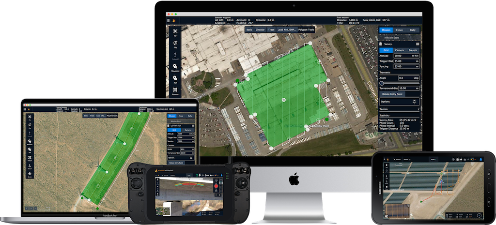
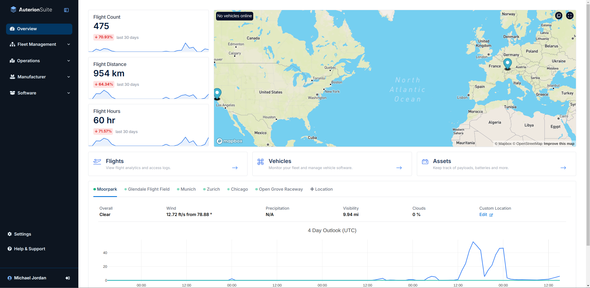

# Auterion Software

### [Auterion Mission Control](https://docs.freeflysystems.com/astro/~/revisions/mTpQspqCOZxVfR8CbzgE/pilots-operating-handbook/essential-software/auterion-mission-control)

<figure><figcaption></figcaption></figure>

**Auterion Mission Control (AMC)** is the mission planning software pre-installed on Pilot Pro.&#x20;

### [Auterion Suite](https://docs.freeflysystems.com/astro/~/revisions/mTpQspqCOZxVfR8CbzgE/pilots-operating-handbook/essential-software/auterion-suite)

<figure><figcaption></figcaption></figure>

**Auterion Suite** is an _optional_ fleet management web app that is fully compatible with Astro. It has useful features like automatic flight log uploads, image uploads, and more. Learn more by visiting [Auterion's documentation](https://docs.auterion.com/vehicle-operation/auterion-suite-fleet-management).

