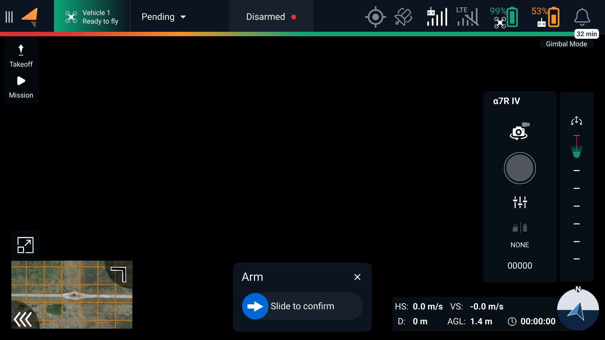
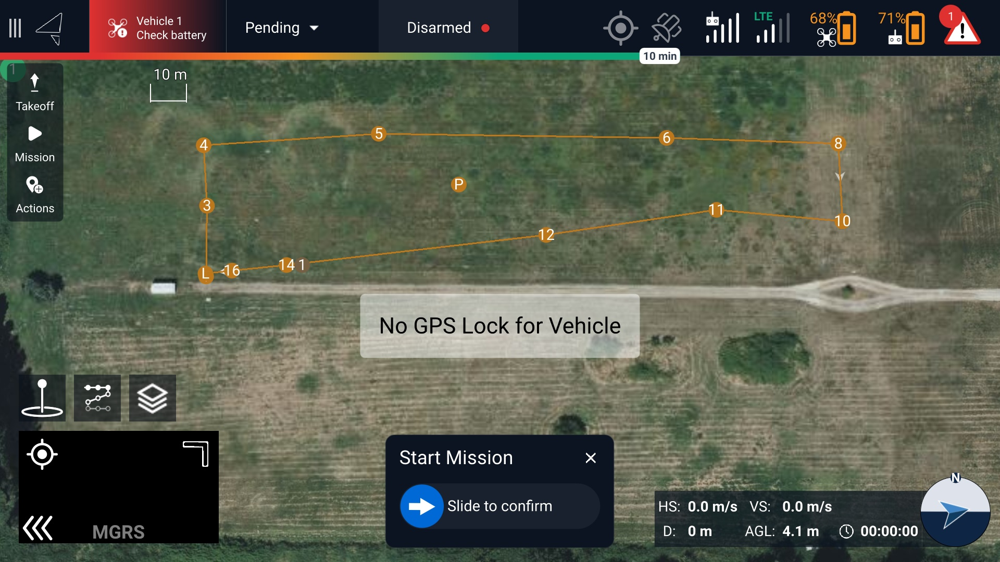
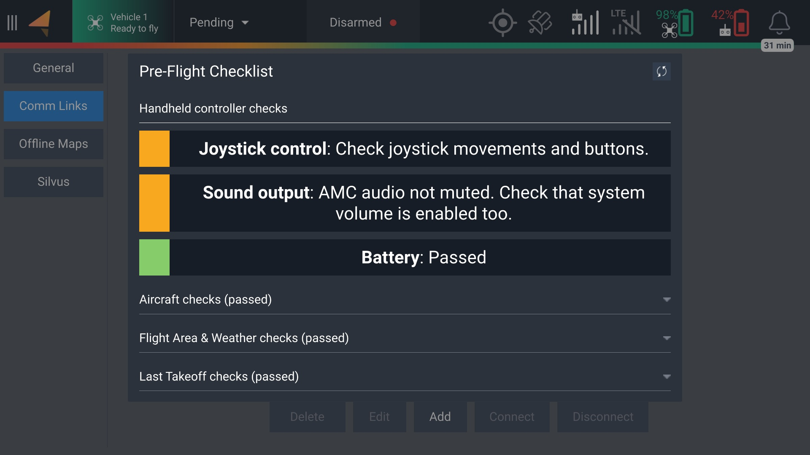
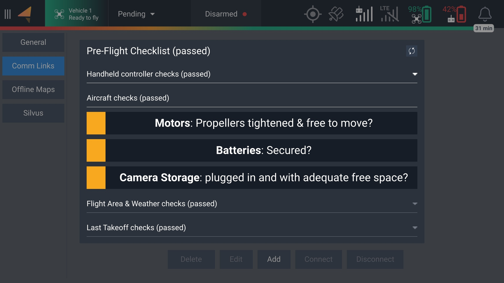
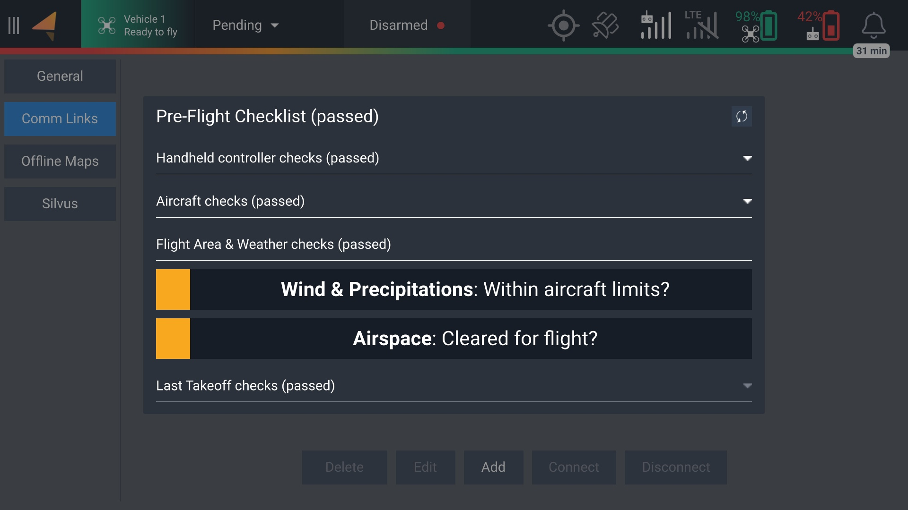
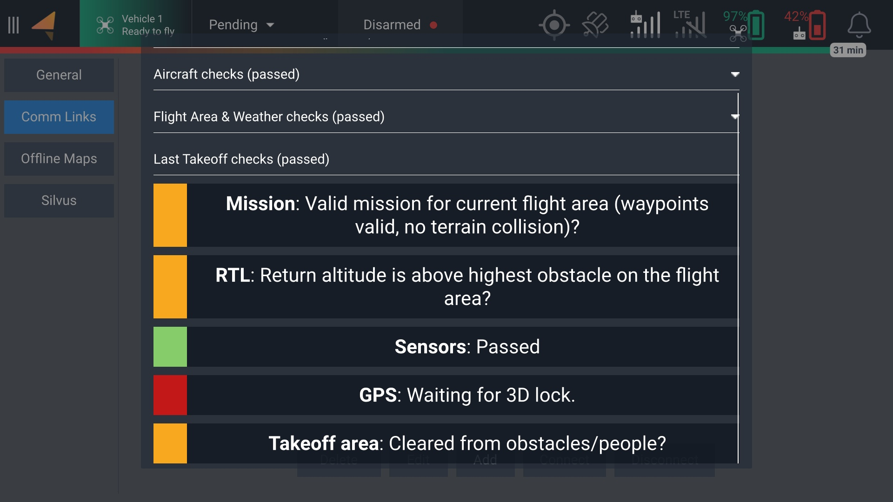

# AMC - Fly

## Camera View

This screen includes a live camera feed, telemetry, and camera/gimbal control. You can also launch uploaded missions or take off using the touch screen.&#x20;

<figure><figcaption></figcaption></figure>

## Map View

This screen shows the nearby satellite map, as well as the currently uploaded mission when applicable.&#x20;

<figure><figcaption></figcaption></figure>

## Pre-Flight Checklist

An optional checklist to assess the requirements of flying a safe mission or manual flight. This checklist can be accessed by tapping the Vehicle box near the top-left corner of the screen. Tapping the yellow boxes turns them green, allowing you to manually verify each item before takeoff.&#x20;

Red items represent warnings or errors. Some items will prevent takeoff if there is an associated warning or error, such as insufficient battery power. Others will allow for takeoff with some limited usage. In the example below, there is no GPS signal, so the aircraft will only be capable of taking off in Manual mode.&#x20;

<figure><figcaption></figcaption></figure>

<figure><figcaption></figcaption></figure>

<figure><figcaption></figcaption></figure>

<figure><figcaption></figcaption></figure>

