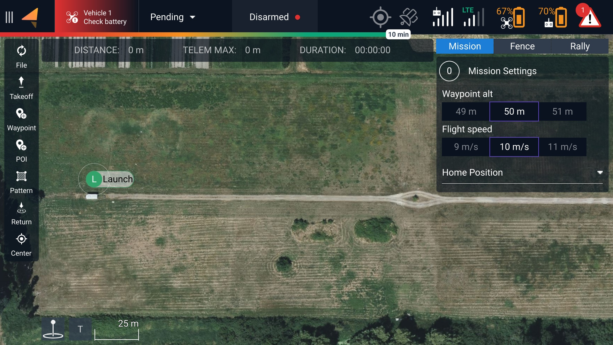
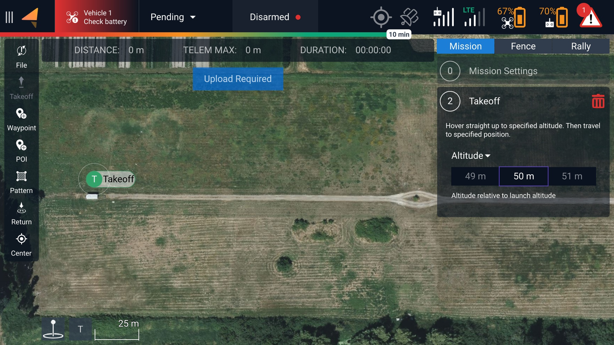
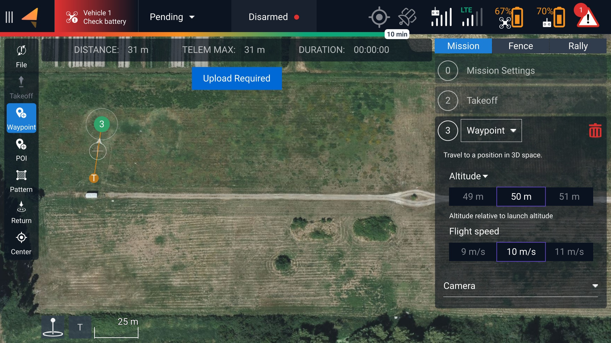
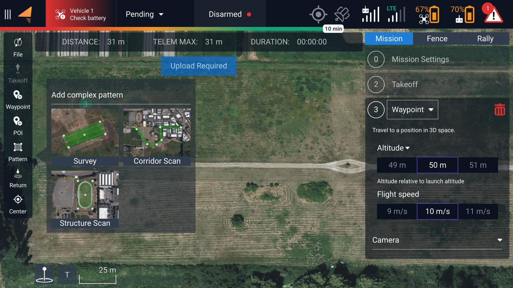
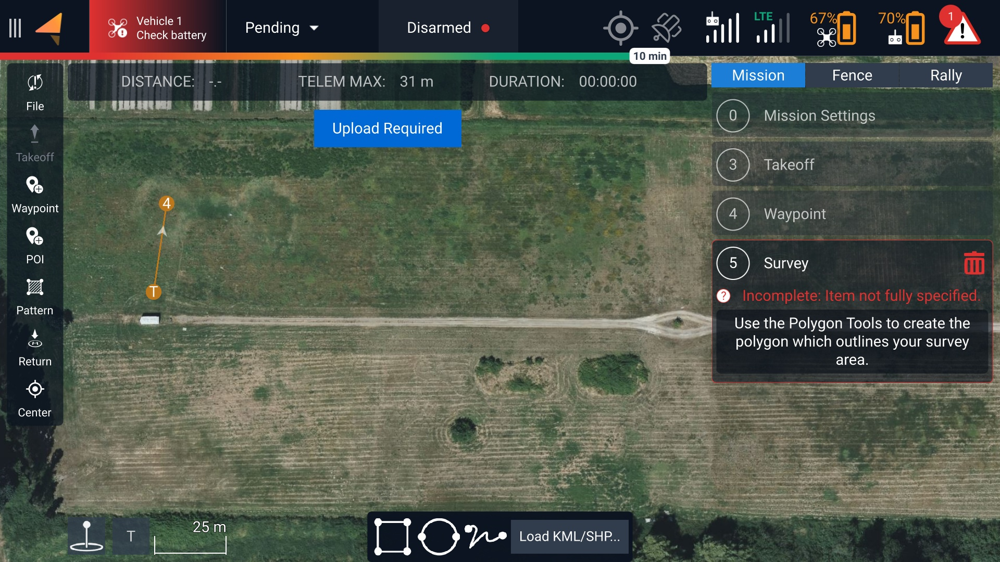
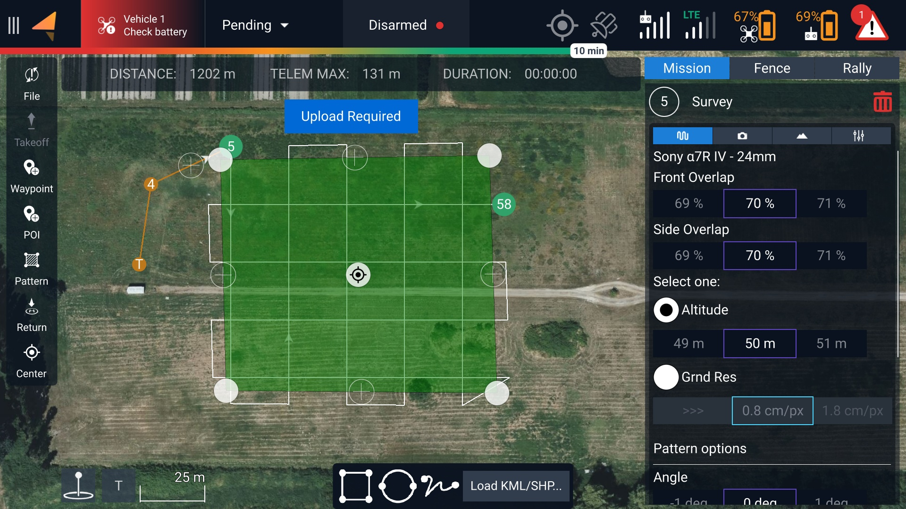
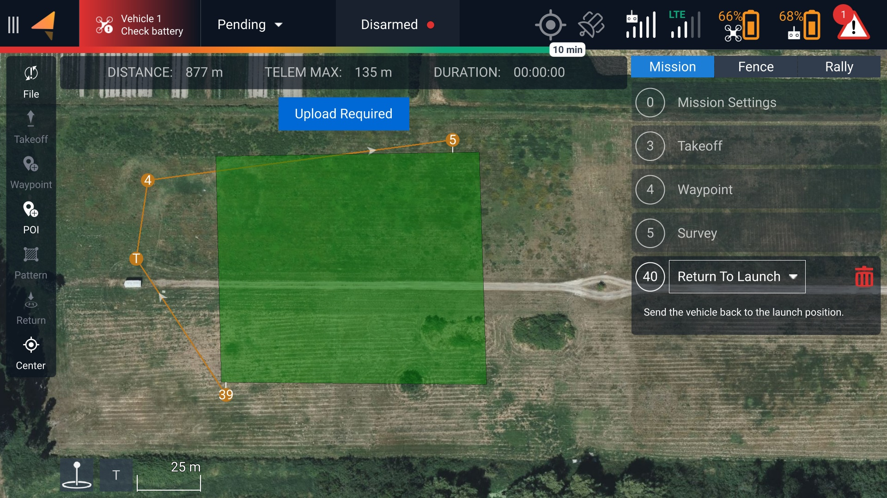

# AMC - Plan

## Example Mission







<figure><figcaption>
The default view for a new mission as shown on the Plan screen.  
</figcaption></figure>

<figure><figcaption>
After selecting the Takeoff icon along the left-hand side of the Plan screen.  
</figcaption></figure>

<figure><figcaption>
Using the Waypoint tool to create the first waypoint for the drone to move towards after takeoff.  
</figcaption></figure>

<figure><figcaption>
After selecting the Pattern button along the left, this pop-up appears prompting you to select the type of pattern. In this example, we will pick the Survey option.  
</figcaption></figure>

<figure><figcaption>
After selecting Survey, a tool appears on the bottom of the screen allowing you to define the area of your survey.  
</figcaption></figure>

<figure><figcaption>
We defined the area of our survey by moving the white dots at the corners of the square. 
</figcaption></figure>

<figure><figcaption>
After we have a pattern we are happy with, we can select the Return button on the left to ask the drone to return to the launch point. 
</figcaption></figure>



### Front Overlap

Definition: The amount that each image overlaps with the previous sequential image; effectively, you are taking pictures more frequently on each straightaway of your mission. \
\
Benefit: The higher the front overlap, the more consistent your resulting map will likely be, as the stitching software will have an easier time connecting the discreet images together.&#x20;

Tradeoff: You will be taking more pictures, many of which are redundant to an extent. This takes up more storage and takes more time to process. \
\
When changing this value, keep in mind that your photo interval needs to be greater than or equal to 2.0 seconds. The USB drive cannot save large images any faster. \
\
Recommended value: 70%

### Side Overlap

#### Definition

The amount that each image overlaps with the adjacent images in a parallel leg of the mission. The higher the value, the closer each swath of the mission will be to its neighboring swath.&#x20;

#### Benefit&#x20;

Like front overlap, higher side overlap increases the consistency of your stitching software by introducing more redundant landmarks that help combine the two photos together.&#x20;

#### Tradeoff

Due to the increased number of passes over the same area, increasing side overlap will also increase the duration of your mission. Unlike front overlap, increasing your side overlap percentage does not increase your photo interval, though it will still increase the total number of pictures taken.

Recommended value: 70%

### Altitude vs. Ground Resolution (GSD)

The Survey options ask you to select one: Altitude or GSD. These two options are directly proportional and can be selected based on the mission area and your requirements.&#x20;

GSD, or Ground Resolution, is a general approximation of the fidelity of each image when compared to real-world measurements. For example, a ground resolution of 1 cm/px posits that every single pixel in the resulting map will be approximately 1 centimeter in length. \
\
This measurement can be calculated using the camera's resolution and the distance from the object being photographed. It stands to reason that if we have the desired ground resolution and the camera's resolution as known variables, the distance (or altitude of the aircraft) can be calculated as well!

Notice how changing the altitude or GSD sliders will also change the other option automatically. If you are using GSD, make sure that the resulting altitude is still clear of any obstacles.&#x20;

Pattern Options

