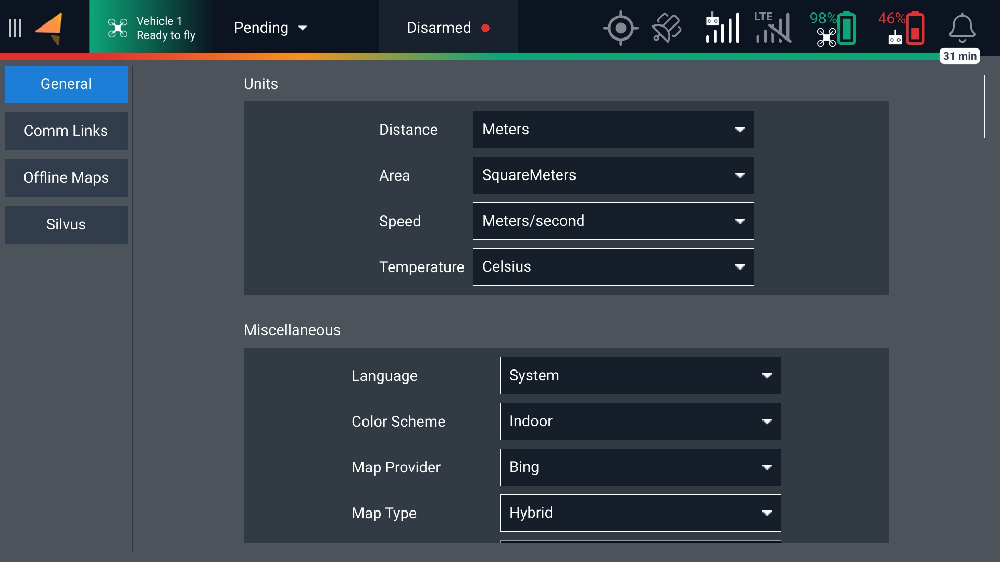
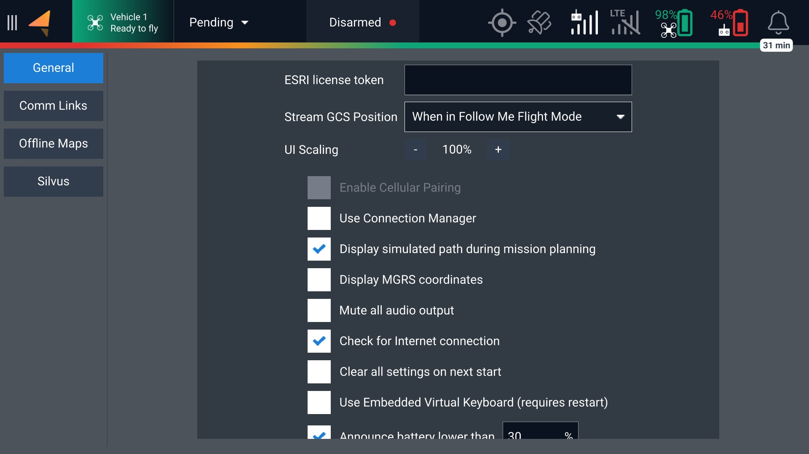
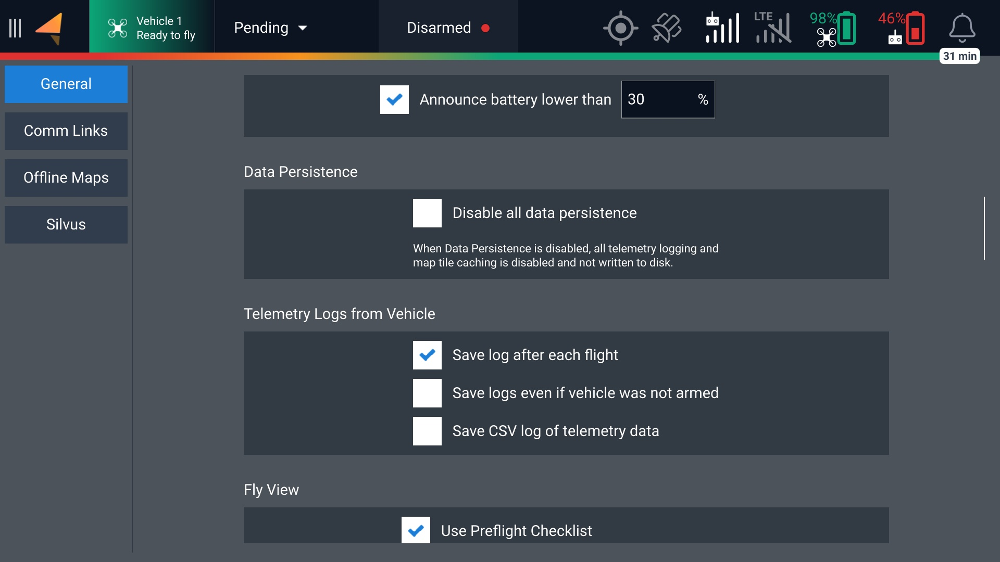
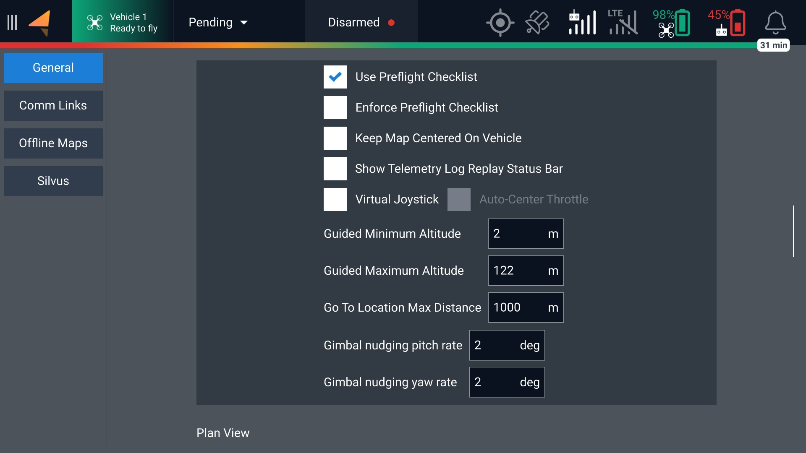
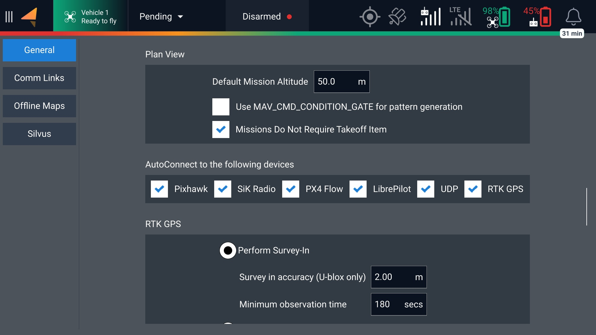
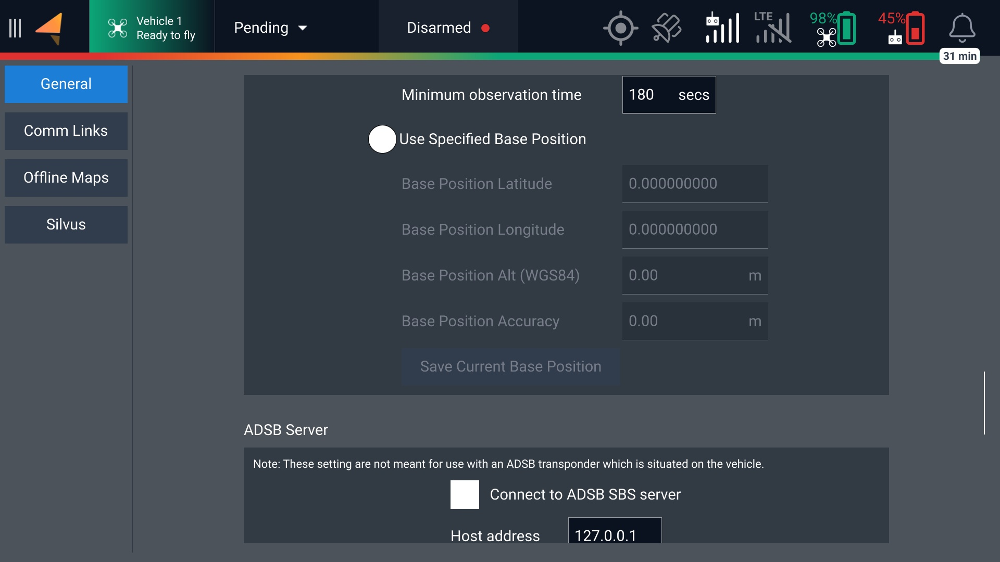
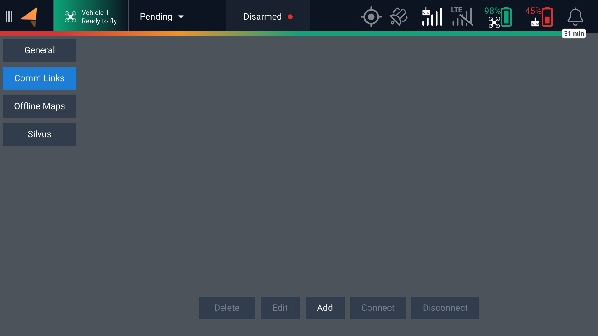
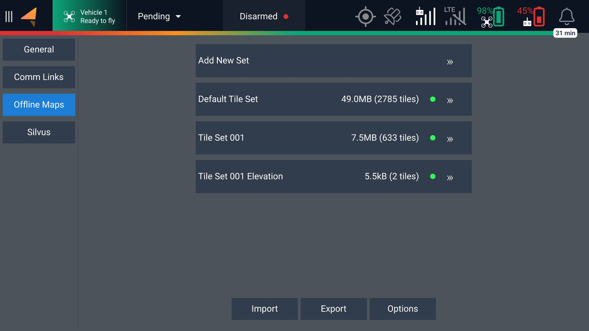
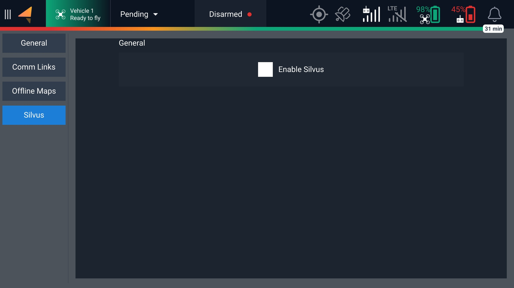

# AMC - Settings

## General

<figure><figcaption></figcaption></figure>

<figure><figcaption></figcaption></figure>

<figure><figcaption></figcaption></figure>

<figure><figcaption></figcaption></figure>

<figure><figcaption></figcaption></figure>

<figure><figcaption></figcaption></figure>

<figure><figcaption></figcaption></figure>

<figure><figcaption></figcaption></figure>

## Comm Links

<figure><figcaption></figcaption></figure>

## Offline Maps

<figure><figcaption></figcaption></figure>

## Silvus

<figure><figcaption></figcaption></figure>

