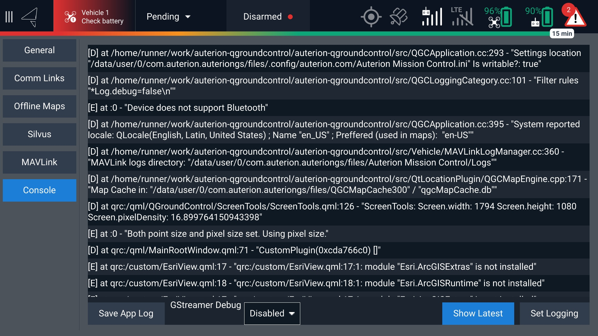

# Advanced Mode

By default, AMC hides features, settings, and menus that are not relevant for a drone operator or not intended to be changed by the end user. For development tasks, Auterion Mission Control can be switched into an advanced mode which enables additional menus and features, most notably:

* Analyze Tab -> MAVlink Console
* Analyze Tab -> MAVlink Inspector
* Vehicle Setup Tab

### Enable Advanced Mode in AMC 

In order to switch into the advanced mode, **quickly tap the logo about 7 times** in the top left corner until you are prompted to confirm the change to Advanced Mode.

## MavLink

<figure><figcaption></figcaption></figure>

## Console

<figure><figcaption></figcaption></figure>
