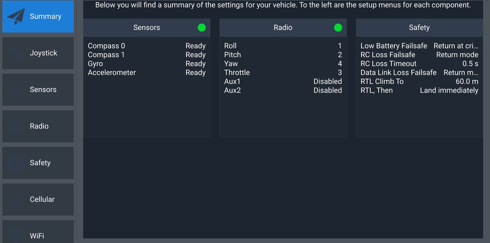
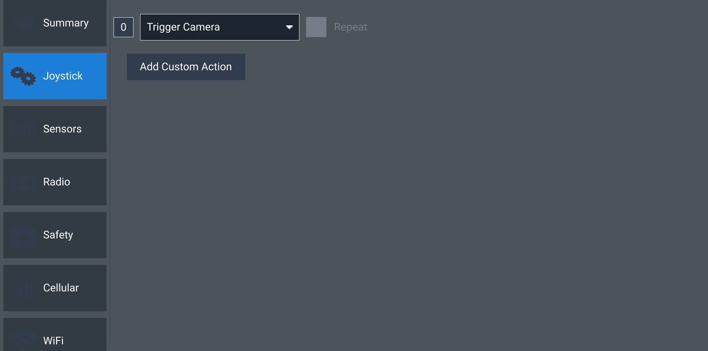
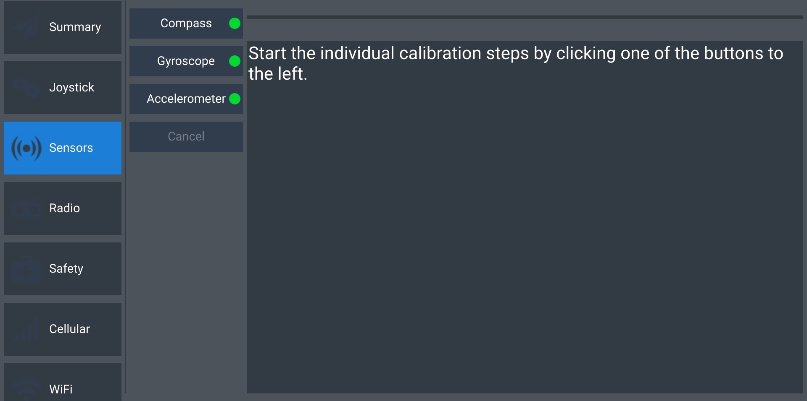
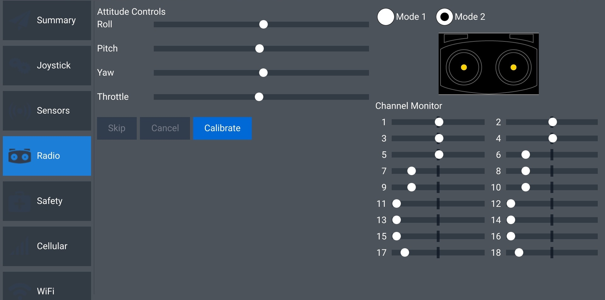
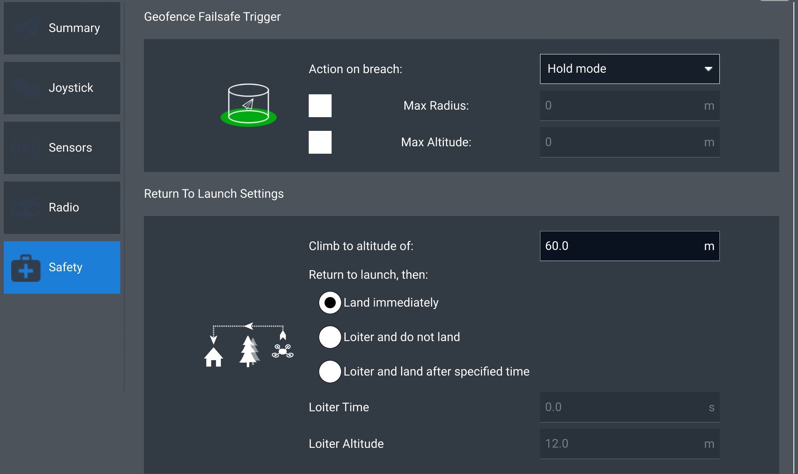
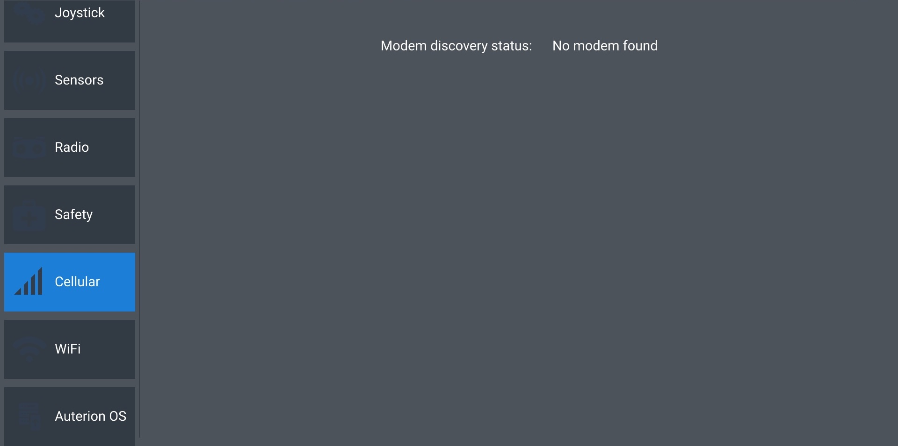
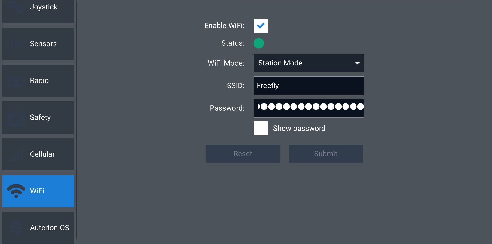

# AMC - Vehicle Setup

## Summary

Provides a brief overview of the main vehicle setup bullet-points that pilots should consider before takeoff. If there is an issue with the sensors or radio, the green dots seen below will instead be red.&#x20;

<figure><figcaption></figcaption></figure>

## Joystick

Currently, the only functionality of this screen is to change and test the functionality of the physical button on the top-right corner of the controller.&#x20;

Use the dropdown to select the functionality of the button. Watch the box with the 0 in it while pressing the button to verify that it is working.&#x20;

<figure><figcaption></figcaption></figure>

## Sensors

Select Compass, Gyroscope, or Accelerometer to recalibrate. Calibration is recommended for any sensors marked with a red dot.&#x20;

<figure><figcaption></figcaption></figure>

## Radio

Displays a live view of the radio inputs. Allows you to switch between Mode 1 and Mode 2 control schemes (Mode 2 recommended).&#x20;

<figure><figcaption></figcaption></figure>

## Safety

This screen is essential to operating Astro safely. Ensure that the altitude under Return To Launch Settings is higher than the tallest obstructing obstacle. For instance, if your mission takes place near a 65m tree, a return altitude of 60m is insufficient. If an RTL triggers while the aircraft and the landing point are on opposite sides of this tree and you are unable to regain control, it is unlikely that the aircraft will return to the ground safely in this scenario.&#x20;

<figure><figcaption></figcaption></figure>

## Cellular

<figure><figcaption></figcaption></figure>

## WiFi

<figure><figcaption></figcaption></figure>
