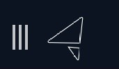
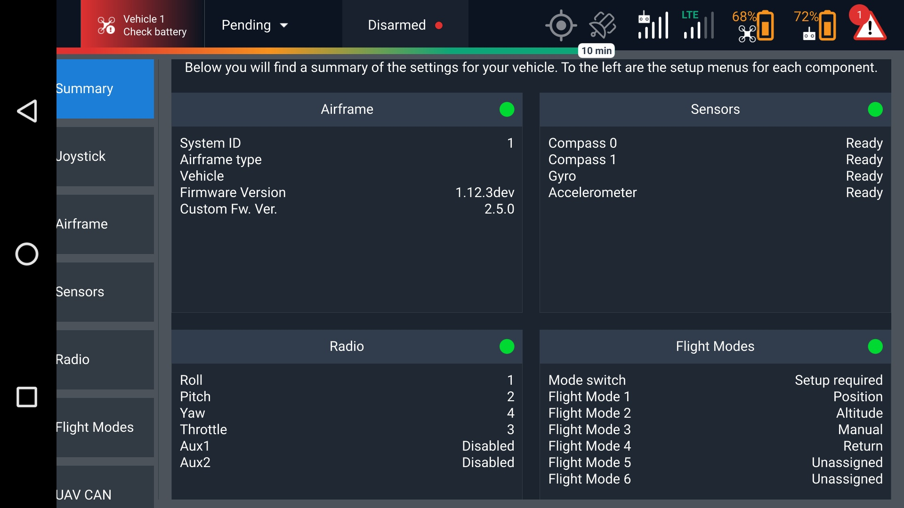
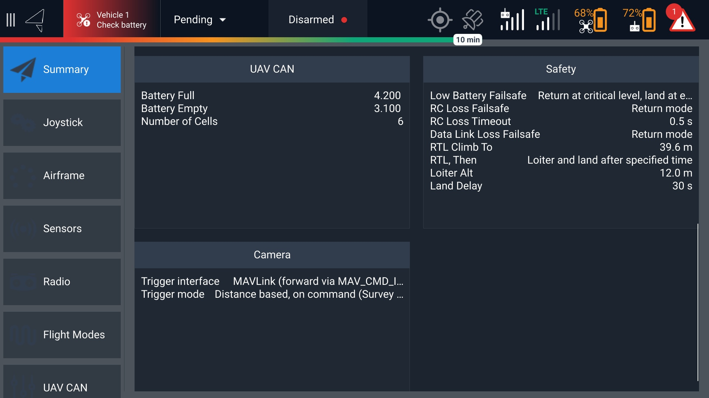
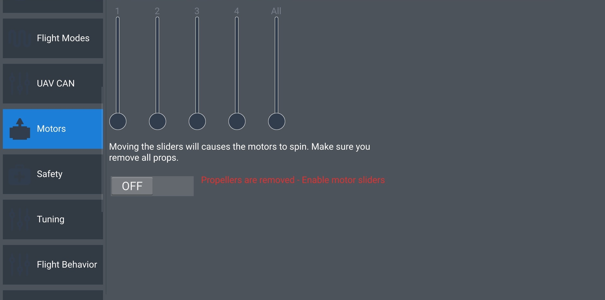
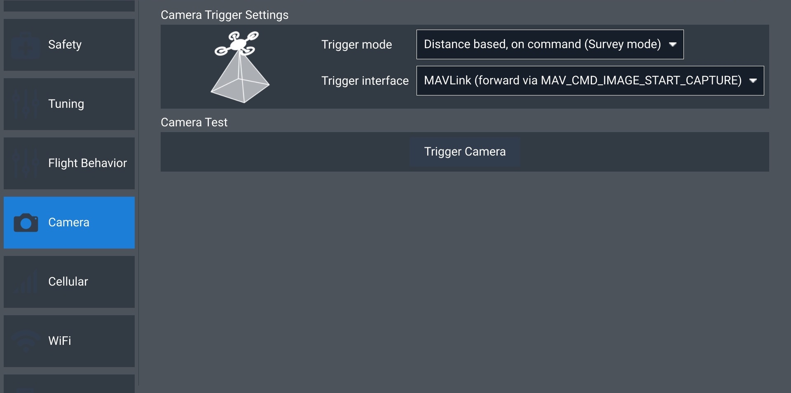

# Advanced Vehicle Setup

Changing these settings requires Advanced Mode, which is not recommended for most pilots. Key safety features and parameters that keep Astro airborne can be disabled if changes are made without understanding their purpose. Keep in mind that changing settings in this mode poses an increased risk to property and safety if not done with careful consideration and care.&#x20;

## Activating Advanced Mode

To switch to Advanced Mode and see many of these options, repeatedly tap on the AMC icon in the top-left-hand corner of the app. After tapping about 6 times, a popup menu will appear asking if you would like to switch to Advanced Mode. The icon will change once Advanced Mode is active. \
\
You can return to Standard Mode by repeating the process of tapping the icon until the menu appears and selecting the option to switch to Standard Mode.&#x20;

## Advanced Summary

<figure><figcaption></figcaption></figure>

<figure><figcaption></figcaption></figure>

## Advanced Airframe

<figure><figcaption></figcaption></figure>

## Advanced Sensors

Be very careful about the Autopilot Orientation setting when calibrating sensors in Advanced Mode. It should not be changed from the default value of ROTATION\_YAW\_270.&#x20;

<figure><figcaption></figcaption></figure>

## Advanced Motors

<figure><figcaption></figcaption></figure>

## Advanced Safety

<figure><figcaption></figcaption></figure>

<figure><figcaption></figcaption></figure>

<figure><figcaption></figcaption></figure>

<figure><figcaption></figcaption></figure>

## Advanced Tuning

<figure><figcaption></figcaption></figure>

## Advanced Camera

<figure><figcaption></figcaption></figure>
